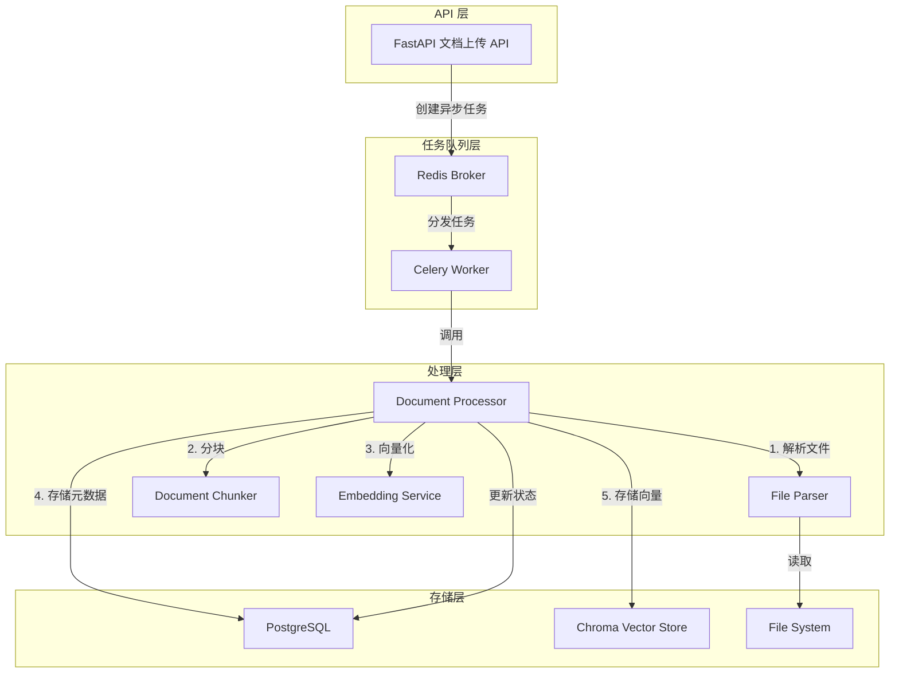
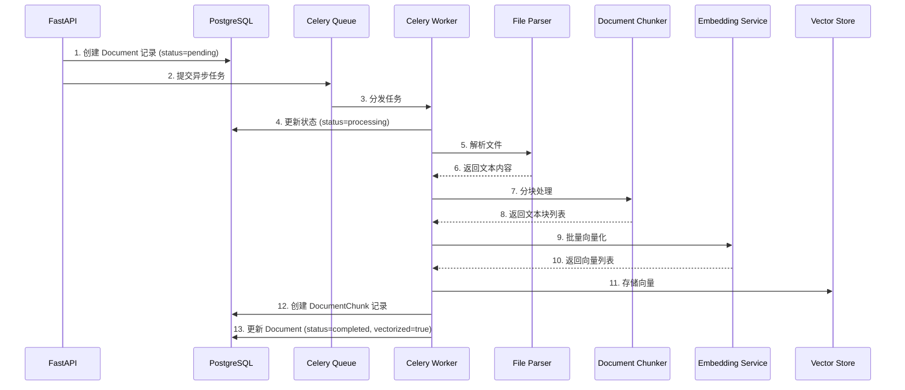
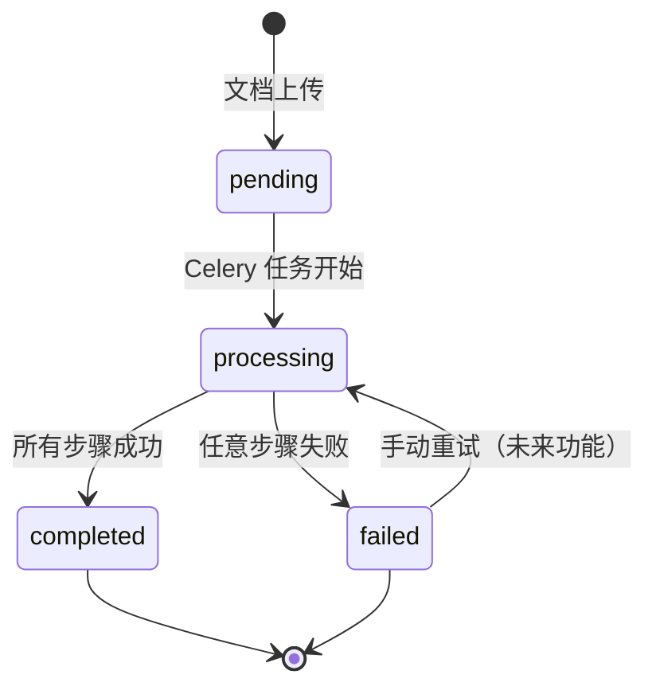

# 技术设计文档 - 文档处理功能

## 概述

本设计文档描述了企业知识库 RAG 系统的文档处理功能的技术实现方案。该功能实现从文档上传到向量化存储的完整自动化处理流程，支持多种文档格式（PDF、Word、TXT、Markdown），并通过异步任务队列实现高效的后台处理。

### 设计目标

1. **多格式支持**: 支持 PDF、Word (.docx)、纯文本 (.txt)、Markdown (.md) 等常见文档格式
2. **智能分块**: 实现基于语义边界的智能文本分块，优化中英文混合文本处理
3. **多提供商支持**: 支持 OpenAI、智谱 AI GLM、阿里云 Qwen 等多种 Embedding 提供商
4. **异步处理**: 使用 Celery 任务队列实现非阻塞的后台文档处理
5. **可靠性**: 完善的错误处理、重试机制和状态追踪
6. **可观测性**: 结构化日志记录和性能监控

### 技术栈

- **后端框架**: FastAPI + SQLAlchemy (async)
- **任务队列**: Celery + Redis
- **向量数据库**: Chroma (支持 Cloud 和本地模式)
- **关系数据库**: PostgreSQL
- **文档解析**: PyPDF2 (PDF)、python-docx (Word)
- **Embedding**: OpenAI SDK (支持多提供商通过 base_url 切换)

## 架构

### 系统架构图



### 处理流程



### 数据流

1. **文档上传**: 用户通过 API 上传文档 → 文件保存到本地文件系统 → 创建 Document 记录
2. **异步处理**: 创建 Celery 任务 → 任务进入 Redis 队列 → Worker 获取任务
3. **文件解析**: 根据文件类型选择解析器 → 提取文本内容和元数据
4. **文本分块**: 应用分块策略 → 生成文本块列表 → 添加元数据
5. **向量化**: 批量调用 Embedding API → 生成向量表示
6. **存储**: 向量存入 Chroma → 分块记录存入 PostgreSQL → 更新文档状态

## 组件和接口

### 1. File Parser (文件解析器)

**职责**: 从不同格式的文件中提取文本内容和元数据

**接口设计**:

```python
class FileParser:
    """文件解析器基类"""
    
    def parse(self, file_path: str) -> ParsedDocument:
        """
        解析文件
        
        Args:
            file_path: 文件路径
            
        Returns:
            ParsedDocument: 包含文本内容和元数据的对象
            
        Raises:
            UnsupportedFileTypeError: 文件类型不支持
            FileParseError: 文件解析失败
        """
        pass

class ParsedDocument:
    """解析后的文档对象"""
    content: str              # 文本内容
    page_count: Optional[int] # 页数（如果适用）
    metadata: Dict[str, Any]  # 元数据（如页码信息、段落结构等）
```

**实现类**:

- `PDFParser`: 使用 PyPDF2 解析 PDF 文件
- `WordParser`: 使用 python-docx 解析 .docx 文件
- `TextParser`: 解析纯文本文件 (.txt)
- `MarkdownParser`: 解析 Markdown 文件 (.md)

**工厂模式**:

```python
class FileParserFactory:
    """文件解析器工厂"""
    
    @staticmethod
    def get_parser(file_type: str) -> FileParser:
        """根据文件类型返回对应的解析器"""
        parsers = {
            "pdf": PDFParser(),
            "docx": WordParser(),
            "txt": TextParser(),
            "md": MarkdownParser(),
        }
        parser = parsers.get(file_type.lower())
        if not parser:
            raise UnsupportedFileTypeError(f"不支持的文件类型: {file_type}")
        return parser
```

### 2. Document Chunker (文档分块器)

**职责**: 将长文本智能分割成适合向量化的文本块

**接口设计**:

```python
class DocumentChunker:
    """文档分块器"""
    
    def __init__(
        self,
        chunk_size: int = 500,
        chunk_overlap: int = 50,
        strategy: ChunkStrategy = ChunkStrategy.SMART
    ):
        """
        初始化分块器
        
        Args:
            chunk_size: 块大小（字符数）
            chunk_overlap: 重叠大小（字符数）
            strategy: 分块策略
        """
        pass
    
    def chunk(
        self,
        text: str,
        metadata: Optional[Dict[str, Any]] = None
    ) -> List[TextChunk]:
        """
        分块处理
        
        Args:
            text: 输入文本
            metadata: 文档元数据
            
        Returns:
            List[TextChunk]: 文本块列表
        """
        pass

class TextChunk:
    """文本块对象"""
    content: str              # 文本内容
    chunk_index: int          # 块序号
    page_number: Optional[int] # 页码（如果可用）
    metadata: Dict[str, Any]  # 元数据

class ChunkStrategy(Enum):
    """分块策略"""
    SIMPLE = "simple"         # 简单固定大小分块
    SMART = "smart"           # 智能边界分块（句子、段落）
    PARAGRAPH = "paragraph"   # 段落分块
    SEMANTIC = "semantic"     # 语义分块（未来扩展）
```

**分块策略**:

1. **简单策略 (SIMPLE)**: 固定大小分块，在字符边界处分割
2. **智能策略 (SMART)**: 
   - 优先在句子边界分割（句号、问号、感叹号）
   - 中文优先在中文标点符号处分割
   - 英文优先在空格处分割
   - 保持代码块完整性
3. **段落策略 (PARAGRAPH)**: 按段落分割，合并小段落

### 3. Embedding Service (向量化服务)

**职责**: 将文本转换为向量表示，支持多种提供商

**接口设计**:

```python
class EmbeddingService:
    """Embedding 服务"""
    
    def __init__(
        self,
        provider: str = "openai",
        model: str = "text-embedding-3-small",
        api_key: str = "",
        base_url: str = "https://api.openai.com/v1",
        batch_size: int = 100,
        max_retries: int = 3
    ):
        """
        初始化 Embedding 服务
        
        Args:
            provider: 提供商名称 (openai/glm/qwen)
            model: 模型名称
            api_key: API 密钥
            base_url: API 基础 URL
            batch_size: 批处理大小
            max_retries: 最大重试次数
        """
        pass
    
    async def embed_texts(
        self,
        texts: List[str]
    ) -> List[List[float]]:
        """
        批量向量化文本
        
        Args:
            texts: 文本列表
            
        Returns:
            List[List[float]]: 向量列表
            
        Raises:
            EmbeddingAPIError: API 调用失败
        """
        pass
    
    async def embed_query(self, text: str) -> List[float]:
        """
        向量化单个查询文本
        
        Args:
            text: 查询文本
            
        Returns:
            List[float]: 向量
        """
        pass
```

**提供商配置**:

| 提供商 | base_url | 模型示例 | 向量维度 |
|--------|----------|----------|----------|
| OpenAI | https://api.openai.com/v1 | text-embedding-3-small | 1536 |
| GLM | https://open.bigmodel.cn/api/paas/v4 | embedding-3 | 2048 |
| Qwen | https://dashscope.aliyuncs.com/compatible-mode/v1 | text-embedding-v4 | 1536 |

**批处理和重试**:

- 每批最多处理 100 个文本
- 失败时重试 3 次，间隔递增（1s、2s、4s）
- 记录详细的 API 调用日志

### 4. Document Processor (文档处理器)

**职责**: 协调整个文档处理流程

**接口设计**:

```python
class DocumentProcessor:
    """文档处理器"""
    
    def __init__(
        self,
        parser_factory: FileParserFactory,
        chunker: DocumentChunker,
        embedding_service: EmbeddingService,
        vector_store: VectorStore,
        db_session: AsyncSession
    ):
        """初始化处理器"""
        pass
    
    async def process_document(
        self,
        document_id: int
    ) -> ProcessingResult:
        """
        处理文档
        
        Args:
            document_id: 文档 ID
            
        Returns:
            ProcessingResult: 处理结果
            
        Raises:
            DocumentProcessingError: 处理失败
        """
        pass

class ProcessingResult:
    """处理结果"""
    document_id: int
    status: str               # completed/failed
    chunk_count: int
    processing_time: float    # 秒
    error_message: Optional[str]
```

**处理步骤**:

1. 从数据库加载 Document 记录
2. 更新状态为 "processing"
3. 调用 FileParser 解析文件
4. 调用 DocumentChunker 分块
5. 调用 EmbeddingService 向量化
6. 存储向量到 VectorStore
7. 创建 DocumentChunk 记录
8. 更新 Document 状态和统计信息
9. 记录性能指标

### 5. Vector Store (向量存储)

**职责**: 管理向量数据的存储和检索

现有实现位于 `backend/app/services/vector_store.py`，已支持：

- Chroma Cloud 和本地模式
- 向量插入、搜索、删除
- 元数据过滤（如按部门 ID）

**扩展需求**:

```python
async def insert_document_chunks(
    self,
    document_id: int,
    chunks: List[TextChunk],
    vectors: List[List[float]],
    metadata: Dict[str, Any]
) -> int:
    """
    批量插入文档分块
    
    Args:
        document_id: 文档 ID
        chunks: 文本块列表
        vectors: 向量列表
        metadata: 文档元数据（如 filename, department_id）
        
    Returns:
        int: 插入的向量数量
    """
    pass

async def delete_document_vectors(self, document_id: int) -> int:
    """
    删除文档的所有向量
    
    Args:
        document_id: 文档 ID
        
    Returns:
        int: 删除的向量数量
    """
    pass
```

## 数据模型

### 数据库表结构

现有表结构位于 `backend/app/models/models.py`，包括：

#### Document 表

```python
class Document(Base):
    """文档元数据表"""
    __tablename__ = "documents"
    
    id: int                           # 主键
    filename: str                     # 文件名（UUID）
    original_filename: str            # 原始文件名
    file_path: str                    # 文件路径
    file_size: int                    # 文件大小（字节）
    file_type: str                    # 文件类型（pdf/docx/txt/md）
    mime_type: str                    # MIME 类型
    
    # 文档内容
    title: Optional[str]              # 标题
    content: Optional[str]            # 文本内容（可选存储）
    page_count: Optional[int]         # 页数
    
    # 处理状态
    status: str                       # pending/processing/completed/failed
    error_message: Optional[str]      # 错误信息
    
    # 权限
    department_id: int                # 部门 ID（外键）
    uploaded_by: int                  # 上传者 ID（外键）
    
    # 向量化
    vectorized: bool                  # 是否已向量化
    chunk_count: int                  # 分块数量
    
    # 时间戳
    created_at: datetime
    updated_at: datetime
```

#### DocumentChunk 表

```python
class DocumentChunk(Base):
    """文档分块表"""
    __tablename__ = "document_chunks"
    
    id: int                           # 主键
    document_id: int                  # 文档 ID（外键）
    chunk_index: int                  # 块序号
    content: str                      # 文本内容
    
    # 向量
    vector_id: str                    # 向量 ID（Chroma 中的 ID）
    
    # 元数据
    page_number: Optional[int]        # 页码
    chunk_metadata: Optional[str]     # JSON 字符串（其他元数据）
    
    created_at: datetime
```

### 向量数据库结构

Chroma 集合结构：

```python
{
    "collection_name": "documents",
    "metadata": {
        "hnsw:space": "cosine"  # 余弦相似度
    },
    "vectors": [
        {
            "id": "doc_{document_id}_chunk_{chunk_index}",  # 向量 ID
            "embedding": [0.1, 0.2, ...],                   # 向量（1536 或 2048 维）
            "metadata": {
                "document_id": 123,
                "chunk_id": 456,
                "chunk_index": 0,
                "filename": "example.pdf",
                "department_id": 1,
                "page_number": 1,
                "content": "文本内容..."
            }
        }
    ]
}
```

### 文件系统结构

```
uploads/
├── {uuid1}.pdf
├── {uuid2}.docx
├── {uuid3}.txt
└── {uuid4}.md
```

- 使用 UUID 作为文件名避免冲突
- 保留原始扩展名
- 配置路径: `settings.upload_directory`

## 正确性属性


*属性（Property）是在系统所有有效执行中都应成立的特征或行为——本质上是对系统应该做什么的形式化陈述。属性是人类可读规范与机器可验证正确性保证之间的桥梁。*

### 属性 1: 文件解析输出完整性

*对于任意*支持格式（PDF、docx、txt、md）的文件，调用 `FileParser.parse()` 后，返回的 `ParsedDocument` 对象必须包含非空的 `content` 字段和完整的 `metadata` 字典。

**验证需求: 1.1, 1.2, 1.3, 1.4, 1.7**

### 属性 2: 不支持格式触发错误

*对于任意*不在支持列表（pdf、docx、txt、md）中的文件扩展名，`FileParserFactory.get_parser()` 必须抛出 `UnsupportedFileTypeError` 异常，且异常消息中包含该文件类型名称。

**验证需求: 1.5**

### 属性 3: 分块大小上界不变量

*对于任意*文本内容和任意合法的 `chunk_size` 配置，`DocumentChunker.chunk()` 返回的每个 `TextChunk` 的 `content` 长度必须不超过 `chunk_size`（强制分割时允许轻微超出以保留自然边界，但不超过 `chunk_size + chunk_overlap`）。

**验证需求: 2.1, 2.7**

### 属性 4: 分块覆盖完整性

*对于任意*输入文本，将所有分块的 `content` 按顺序拼接（去除重叠部分）后，必须能够还原出原始文本的全部内容，不丢失任何字符。

**验证需求: 2.1, 2.2**

### 属性 5: 分块重叠一致性

*对于任意*相邻的两个分块 `chunk[i]` 和 `chunk[i+1]`，`chunk[i]` 末尾的 `chunk_overlap` 个字符必须与 `chunk[i+1]` 开头的对应内容相同（当文本长度允许时）。

**验证需求: 2.2**

### 属性 6: 分块序号连续性

*对于任意*文本输入，`DocumentChunker.chunk()` 返回的分块列表中，每个 `TextChunk.chunk_index` 必须从 0 开始，且严格递增，不存在跳跃或重复。

**验证需求: 2.8**

### 属性 7: 向量化输入输出数量一致性

*对于任意*非空文本列表，`EmbeddingService.embed_texts()` 返回的向量列表长度必须严格等于输入文本列表的长度。

**验证需求: 3.1, 3.8**

### 属性 8: 向量维度一致性

*对于任意*输入文本列表，`EmbeddingService.embed_texts()` 返回的每个向量的维度必须等于配置中指定的 `expected_dimension`（如 OpenAI 为 1536，GLM 为 2048）。

**验证需求: 3.9**

### 属性 9: API 失败重试次数上界

*对于任意*导致 API 调用失败的场景，`EmbeddingService` 的实际 API 调用次数必须不超过 `1 + max_retries`（初始调用 1 次加最多 3 次重试），且最终抛出异常。

**验证需求: 3.6, 3.7**

### 属性 10: 向量存储元数据完整性

*对于任意*文档分块和对应向量，调用 `insert_document_chunks()` 后，通过 `document_id` 查询向量存储，返回的每条记录必须包含 `document_id`、`chunk_index`、`filename`、`department_id` 和 `content` 字段。

**验证需求: 4.1, 4.2, 4.3**

### 属性 11: 向量存储返回数量准确性

*对于任意*包含 N 个分块的批量插入操作，`insert_document_chunks()` 的返回值必须等于 N。

**验证需求: 4.7**

### 属性 12: 成功处理后状态一致性

*对于任意*文档，当 `DocumentProcessor.process_document()` 成功完成后，数据库中该文档的 `status` 必须为 `"completed"`，`vectorized` 必须为 `true`，且 `chunk_count` 必须等于实际创建的 `DocumentChunk` 记录数量。

**验证需求: 5.4, 5.5, 5.6**

### 属性 13: 失败处理后状态一致性

*对于任意*文档，当 `DocumentProcessor.process_document()` 在任意步骤抛出异常时，数据库中该文档的 `status` 必须更新为 `"failed"`，且 `error_message` 字段必须包含非空的错误描述。

**验证需求: 5.7, 5.8**

### 属性 14: 分块记录与文档关联正确性

*对于任意*成功处理的文档，`document_chunks` 表中所有关联该文档的记录数量必须等于 `documents.chunk_count`，且每条记录的 `document_id` 必须等于该文档的 `id`。

**验证需求: 6.1, 6.4**

### 属性 15: 文档删除级联清理

*对于任意*已完成处理的文档，删除该文档后，`document_chunks` 表中不应存在任何 `document_id` 等于该文档 `id` 的记录，且向量存储中也不应存在任何关联该文档的向量。

**验证需求: 6.5, 6.6**

### 属性 16: 文件名唯一性

*对于任意*数量的并发文件上传操作，每次上传生成的文件名（UUID + 扩展名）必须全局唯一，不存在重复。

**验证需求: 7.2**

## 错误处理

### 错误分类

| 错误类型 | 触发条件 | 处理方式 |
|----------|----------|----------|
| `UnsupportedFileTypeError` | 文件格式不支持 | 立即失败，返回 400 错误 |
| `FileParseError` | 文件损坏或无法读取 | 更新状态为 failed，记录错误 |
| `EmbeddingAPIError` | Embedding API 调用失败 | 重试 3 次后失败，更新状态 |
| `VectorStoreError` | 向量存储操作失败 | 更新状态为 failed，记录错误 |
| `DocumentProcessingError` | 处理流程中的通用错误 | 更新状态为 failed，记录完整堆栈 |

### 错误传播策略

1. **解析阶段**: 捕获所有解析异常，包装为 `FileParseError`，更新文档状态为 `failed`
2. **分块阶段**: 分块失败通常是内存或逻辑错误，记录后更新状态为 `failed`
3. **向量化阶段**: 重试机制处理临时 API 故障，超过重试次数后更新状态为 `failed`
4. **存储阶段**: 向量存储失败需要回滚已创建的分块记录，保持数据一致性

### 状态机



## 测试策略

### 双重测试方法

本功能采用单元测试和属性测试相结合的方式，两者互补，共同保证系统正确性：

- **单元测试**: 验证具体示例、边缘情况和错误条件
- **属性测试**: 通过随机生成大量输入验证普遍性属性

### 单元测试重点

- 各格式文件解析器的具体示例（已知 PDF、docx 内容的解析结果）
- 分块器对特定文本的分割结果（中英文混合、代码块）
- Embedding 服务的 API 调用模拟（mock）
- 文档处理器的完整流程集成测试
- 错误条件：损坏文件、API 超时、磁盘空间不足

### 属性测试重点

使用 Python 的 `hypothesis` 库实现属性测试，每个属性测试最少运行 100 次迭代。

每个属性测试必须通过注释标注对应的设计属性：

```python
# Feature: document-processing, Property 4: 分块覆盖完整性
@given(text=st.text(min_size=1, max_size=10000))
@settings(max_examples=100)
def test_chunking_coverage(text):
    chunker = DocumentChunker(chunk_size=500, chunk_overlap=50)
    chunks = chunker.chunk(text)
    # 验证所有分块内容能还原原始文本
    ...
```

**属性测试覆盖列表**:

| 属性编号 | 测试描述 | 生成器策略 |
|----------|----------|------------|
| 属性 1 | 解析器输出完整性 | 生成随机文本内容写入各格式文件 |
| 属性 2 | 不支持格式触发错误 | 生成随机非支持扩展名字符串 |
| 属性 3 | 分块大小上界 | 生成随机长文本和随机 chunk_size |
| 属性 4 | 分块覆盖完整性 | 生成随机文本，验证内容无丢失 |
| 属性 5 | 分块重叠一致性 | 生成随机文本，验证相邻块重叠 |
| 属性 6 | 分块序号连续性 | 生成随机文本，验证序号从 0 递增 |
| 属性 7 | 向量化数量一致性 | 生成随机文本列表（mock API） |
| 属性 8 | 向量维度一致性 | 生成随机文本，验证向量维度 |
| 属性 9 | 重试次数上界 | 模拟 API 持续失败，统计调用次数 |
| 属性 12 | 成功处理状态一致性 | 生成随机文档，验证处理后状态字段 |
| 属性 13 | 失败处理状态一致性 | 注入随机步骤失败，验证 failed 状态 |
| 属性 14 | 分块记录关联正确性 | 生成随机文档，验证分块记录数量和关联 |
| 属性 15 | 删除级联清理 | 生成随机文档，处理后删除，验证清理 |
| 属性 16 | 文件名唯一性 | 生成大量并发上传请求，验证文件名唯一 |
